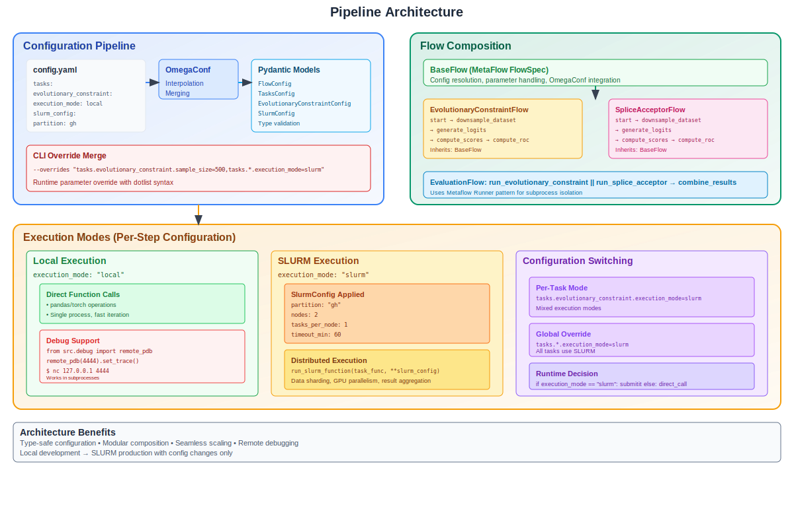

# BioLM Demo Repository

Biological Language Model data, training and inference pipeline prototypes.



## Setup

This project uses [uv](https://docs.astral.sh/uv/) for Python dependency management.

```bash
# Install uv
# ----------
# Move uv home to same filesystem as project repo which is useful
# on hosts with ephemeral root mounts (e.g. Lambda Labs); see:
# https://docs.astral.sh/uv/reference/installer/#changing-the-installation-path
export UV_INSTALL_DIR=`findmnt --first-only --noheading --output=target --target .`
curl -LsSf https://astral.sh/uv/install.sh | sh

# Create environment
# ------------------
uv venv --python 3.12
uv sync # Install core dependencies (namely torch) prior to mamba
uv sync --extra mamba

# Install dev tools
# -----------------
uv sync --extra mamba --group dev
uv run pre-commit install
```

## Execution

WIP

TODO:

- Add configuration docs
- Explain handling failures
- Discuss SLURM steps and storage for inputs/outputs

```bash
export METAFLOW_RUN_MAX_WORKERS=1
export PIPELINE_DIR=src/pipelines/plantcad2/evaluation

# Execute a terminal flow
uv run $PIPELINE_DIR/tasks/evolutionary_constraint/flow.py run

# Execute a terminal flow with config overrides
uv run $PIPELINE_DIR/tasks/evolutionary_constraint/flow.py run \
--overrides "tasks.evolutionary_constraint.output_dir=data/evolutionary_constraint_override"

# Execute a parent flow composing terminal flows
uv run $PIPELINE_DIR/flow.py run
```

## Storage

Shared storage is currently supported via Hugging Face. See the [Hugging Face Filesystem API](https://huggingface.co/docs/huggingface_hub/main/en/package_reference/hf_file_system) docs for more details.

### Reading data

```python
from src.io import HfRepo
import pandas as pd

# Read openai/gsm8k test split
repo = HfRepo.from_repo_id("openai/gsm8k", type="dataset")
df = pd.read_parquet(repo.url("main/test-00000-of-00001.parquet"))

# Alternatively, use explicit factory function
from src.io import hf_repo

# Create repo reference
gsm8k_repo = hf_repo("gsm8k", entity="openai", type="dataset", internal=False)
train_df = pd.read_parquet(gsm8k_repo.url("train/train-00000-of-00001.parquet"))
```

### Writing data

Note: Writing data requires authentication. Use `huggingface-cli login` or set your HF token.

```python
from src import io

# Create repo reference (uses "plantcad" as default entity)
repo = io.hf_repo("test-dataset", type="dataset")

# Create the dataset repository on HuggingFace Hub
repo_url = io.create_on_hub(repo, private=False)

# Get filesystem instance and write data
fs = io.filesystem()
content = "This is a test data file."
with fs.open(repo.url("data.txt"), "w") as f:
    f.write(content)

# Example with internal naming convention
internal_repo = io.hf_internal_repo("test-dataset")
io.create_on_hub(internal_repo, private=False)  # Creates "plantcad/_dev_test-dataset"

with fs.open(internal_repo.url("data.txt"), "w") as f:
    f.write(content)
```

## Debugging

Metaflow has no serial, local execution mode which makes debugging with `pdb` or `ipdb` difficult; see https://github.com/Netflix/metaflow/issues/89.  This utility below can be used to debug subprocesses, however, which provides access to a PDB debugging session through a local TCP socket.

```python
from src.debug import remote_pdb; remote_pdb(4444).set_trace()
# Connect with this in another terminal: nc 127.0.0.1 4444
```
